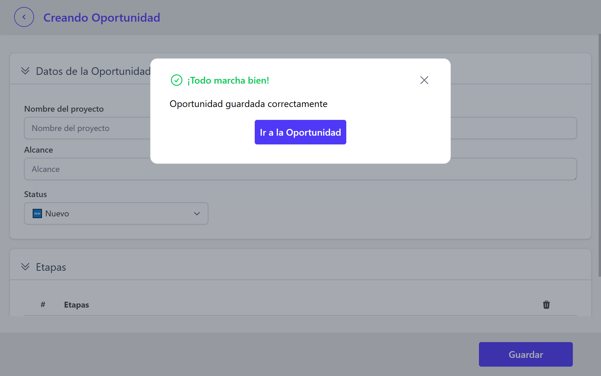

# Flujo de trabajo de modulo de Oportunidades
## Creación de Oportunidad
Dentro del módulo de **Oportunidades** en la parte inferior (pie de página) se encuentra el botón **Nueva Oportunidad**, este lo llevará al formulario para crear la oportunidad. El formulario cuenta con los siguientes campos:
#### Obligatorios
- Nombre de Oportunidad
- Selección de Cliente
- Status: inicia en `🆕 Nuevo`
#### Opcionales
- Alcance de la oportunidad
- Etapas

**Importante** Las etapas estan relacionadas con la cotización, por tanto, si no se asignan etapas al proyecto, se asume una *única* etapa, la cual se denominará como el nombre de la oportunidad.

Al guardar, se mostrará una tarjeta confirmando la operación y un botón que lo redirigirá a la oportunidad recien creada.

## Entrando a la Oportunidad
Al entrar en la oportunidad, se encontrará con el nombre de la oportunidad en el encabezado, y debajo una serie de pestañas:
1. **Resumen:** muestra datos relevantes de la oportunidad
2. **Información:** En esta pestaña se muestra lo agregado en el alta de la oportunidad
3. **Cotización:** si es la primera vez que entra a la oportunidad o aún no se ha ingresado datos de cotización, se mostrará un mensaje indicando que no hay cotizaciones, y se invitará a `Agregar Cotización` ó `Duplicar Cotización`.
Si ya ha agregado detalles a la cotización, se mostrarán los mismos.

Para editar algún dato debe ir al boton color *rosa fuerte* que está en la esquina inferior, este botón con el icono de lápiz, habilitara la edición de los campos (siempre y cuando el status de la oportunidad lo permita)